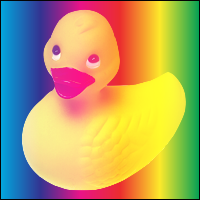
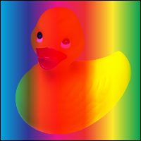
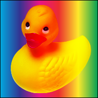
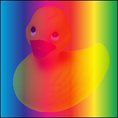
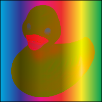
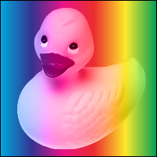
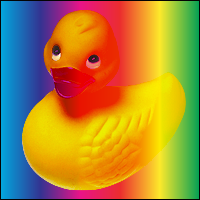
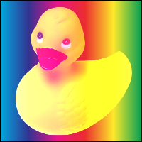

#  Image4Layer

It is implemented by 'pillow' in blend mode of CSS3. And more...

# Install

```
pip install image4layer
```

# Usage


```python
from PIL import Image
from image4layer import Image4Layer

source = Image.open("tests/ducky.png")
backdrop = Image.open("tests/backdrop.png")
```


```python
Image4Layer.__version__
```


    '0.43'


# Separable blend modes

### normal


```python
Image4Layer.normal(backdrop, source)
```


### multiply


```python
Image4Layer.multiply(backdrop, source)
```


### screen


```python
Image4Layer.screen(backdrop, source)
```





### overlay


```python
Image4Layer.overlay(backdrop, source)
```





### darken


```python
Image4Layer.darken(backdrop, source)
```


### lighten


```python
Image4Layer.lighten(backdrop, source)
```


### color-dodge


```python
Image4Layer.color_dodge(backdrop, source)
```


### color-burn


```python
Image4Layer.color_burn(backdrop, source)
```


### hard-light


```python
Image4Layer.hard_light(backdrop, source)
```





### soft-light


```python
Image4Layer.soft_light(backdrop, source)
```





### difference


```python
Image4Layer.difference(backdrop, source)
```


### exclusion


```python
Image4Layer.exclusion(backdrop, source)
```


# Non-separable blend modes

### hue


```python
Image4Layer.hue(backdrop, source)
```


### saturation


```python
Image4Layer.saturation(backdrop, source)
```


### color


```python
Image4Layer.color(backdrop, source)
```





### luminosity


```python
Image4Layer.luminosity(backdrop, source)
```





# More blend modes

### vivid-light


```python
Image4Layer.vivid_light(backdrop, source)
```


### pin-light


```python
Image4Layer.pin_light(backdrop, source)
```





### linear-dodge


```python
Image4Layer.linear_dodge(backdrop, source)
```





### subtract


```python
Image4Layer.subtract(backdrop, source)
```


